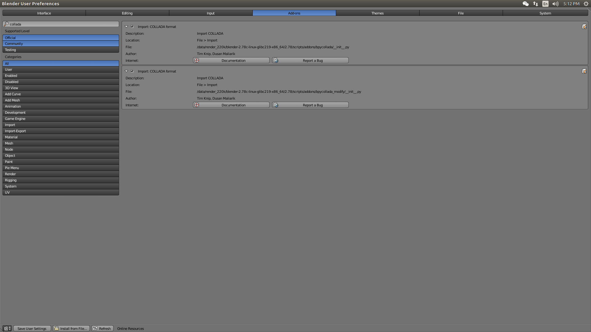

# ShapeNet-Modification
## Install Collada Importer
Blender 2.78 is recommended.
Copy the files in ``.importer`` to ``Blender/2.78/scripts/addons/``.

You can install the archive using the ``Install from File...`` button in ``File->User preferences...->Add-ons``.
After installing you have to find the add-on and activate it.

After this procedure, both exporters are available.

Need add pycollada, six.py, numpy for python 3.5 in Blender 2.78

##Preparation for Python
Python >= 3.6
Need pycollada, numpy

## Process model
``draw_all.py -d <directory> -n <number>`` Process .kmz or .dae in the directory.

``process_dae.py -i <input_file> -o <output_file>`` Process a single dae file.

